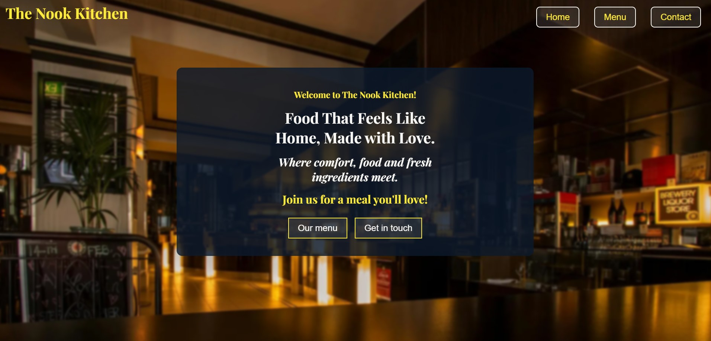

# Restaurant Page 🍽️

[](https://555viktor.github.io/odin-restaurant/)

## Live Preview  
Check out the deployed project here: [Live Preview](https://555viktor.github.io/odin-restaurant/) or click the image above.

## Project Overview  
Welcome to the **Restaurant Page**, a web-based project built using **HTML**, **CSS**, and **JavaScript** with **Webpack**. This app serves as an exercise in applying **ECMAScript Modules (ESM)** and structuring a dynamic, multi-page application. The project was developed as part of an assignment for **The Odin Project**.

## Features  
This restaurant page includes the following features:

- **Home Page:** A welcoming landing page with an introduction to the restaurant.
- **Menu Page:** A detailed list of available dishes, including descriptions and prices.
- **Contact Us Page:** A form for users to reach out to the restaurant.
- **Dynamic Content Loading:** Pages are loaded dynamically using JavaScript, avoiding unnecessary reloads.
- **Modular JavaScript:** The project follows a modular approach for improved maintainability and scalability.
  
## Technologies Used  
- **HTML** – Structures the web pages.
- **CSS** – Provides styling and ensures a responsive design.
- **JavaScript (ESM)** – Handles modular functionality and dynamic content.
- **Webpack** – Bundles and optimizes project assets.

## Installation  
To set up this project locally, follow these steps:

1. Clone the repository to your machine:
   ```bash
   git clone https://github.com/555Viktor/odin-restaurant.git
   ```

2. Navigate into the project folder:
   ```bash
   cd odin-restaurant
   ```

3. Install project dependencies:
   ```bash
   npm install
   ```

4. Start the development server:
   ```bash
   npm run start
   ```

5. Open your browser and go to `http://localhost:8080` to view the page.
   
## Acknowledgements  
This project was created as part of **The Odin Project** curriculum. A special thanks to **The Odin Project** for this valuable learning opportunity.

